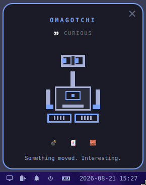

# Omagotchi

A cute tiny robot that sits in your [Omarchy](https://github.com/basecamp/omarchy) bar and keeps you company while you work.



## Install

```bash
omarchy plugin add git@github.com:vdsabev/omagotchi.git --enable --yes
omarchy plugin enable vdsabev.omagotchi --section right
```

Or clone the repo at `~/.config/omarchy/plugins/vdsabev.omagotchi/` and run:

```bash
omarchy-shell shell rescanPlugins
omarchy plugin enable vdsabev.omagotchi
```

## Remove

```bash
omarchy plugin disable vdsabev.omagotchi
omarchy plugin remove vdsabev.omagotchi
```

## Dependencies

- Omarchy Quattro (`omarchy-shell` / Quickshell)
- Hyprland socket - `cursorpos` is used to track the cursor for pupil direction
- UPower - charger sounds; without a battery the plugin stays silent on this point
- `$TERMINAL` - required to launch TUI games (e.g. Omasweeper, Quattrolitaire)

## Features

- Omagotchi lives in the status bar and follows your moving mouse cursor.
- Left click to open a popup with the full robot, a mood line, and the game strip.
- Click the name to rename your bot.
- Shortcuts to games: Omasweeper, Quattrolitaire, and Tetris. Custom games go in `~/.config/omagotchi/games.json` - an array of `{ id, label, icon, kind: plugin|tui|gui, command, install }`, where `tui` gets `$TERMINAL -e`. Games not yet installed are offered via a one-time `omarchy plugin add` confirmation in a popup.
- Moods:
	- `idle`
	- `curious` (eyes following the pointer)
	- `sleepy` (idle)
	- `night` (22:00–07:00)
	- `happy` (you clicked)
- Sound effects: beep on popup open, whir on blink, a rising chirp when the charger goes in and a falling tone when it comes out. The speaker button in the popup mutes them - it silences only Omagotchi, not the system, and reaches every bar.
- State: `~/.config/omagotchi/state.json` (nickname, last click, mute).

## File structure

- `manifest.json` - plugin contract (kind: bar-widget)
- `checkManifest.mjs` - CI guard requiring a version bump on every PR
- `package.json` - test runner config
- `BarWidget.qml` - bar eyes + popup (one Panel-rooted entry point)
- `CursorTracker.qml` - Hyprland socket `cursorpos` → look direction
- `PowerWatcher.qml` - UPower `onBattery` → charger plug and unplug sounds
- `Eyes.qml` - shared binocular head
- `GameStrip.qml` - game icon strip, install confirm
- `Games.js` - game list, launch and install commands
- `Games.test.mjs` - game list tests
- `loadLib.mjs` - test helper that loads QML libraries into Node
- `NicknameField.qml` - editable pet name
- `PetState.js` - moods, flavor, nickname and state-file rules
- `PetState.test.mjs` - mood tests
- `PetPanel.qml` - persistent popup window
- `Robot.qml` - full body
- `SoundEngine.qml` - sound effect playback
- `bin/beep.sh` - beep sound script
- `bin/whir.sh` - whir sound script
- `bin/charge.sh` - charger plug-in chirp
- `bin/unplug.sh` - charger unplug tone
- `bin/play.sh` - shared playback for the sound scripts

Tests run with `npm test`.

## License

[MIT](LICENSE)
